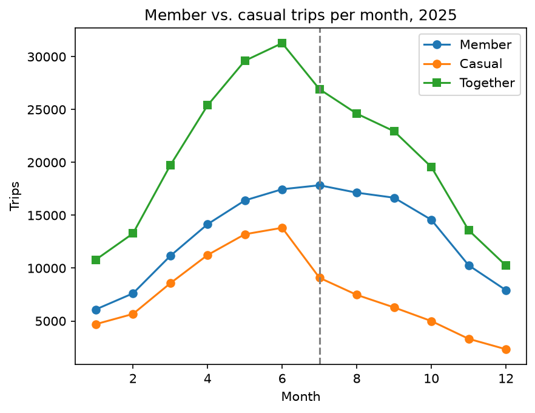

# Ride Knox Ridership Analysis, 2025

## Overview
Which riders drove the 2025 decline, and where is dock capacity strained?

- **Data:** 247,967 cleaned trips across 24 stations
- **Tools:** Python, pandas, matplotlib

## Key finding
Casual ridership fell off a cliff after the **July 1 price increase**
(13,816 trips in June -> 9,088 in July), while member ridership followed
a normal seasonal curve.

