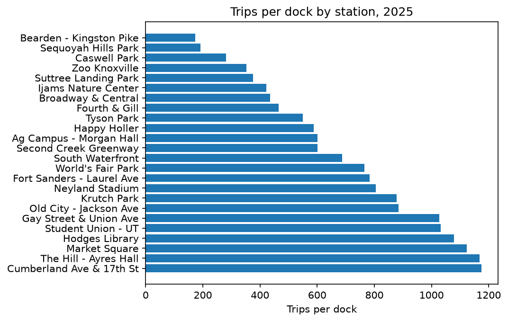

# Ride Knox Ridership Analysis, 2025

**Which riders drove the 2025 decline, and where is dock capacity strained?**

- **Data:** 247,967 cleaned trips across 24 stations
- **Tools:** Python, pandas, matplotlib

## Key Finding

Casual ridership fell off a cliff after the **July 1 price increase**
(13,816 trips in June → 9,088 in July), while member ridership followed
a normal seasonal curve.

## Where the Pressure Is

The busiest stations run well above the fleet's average trips-per-dock,
pointing to where new capacity is needed most.

## Read More

- 📓 [Full analysis notebook](analysis.ipynb) — the complete cleaning,
  EDA, and chart-building pipeline
- 📝 [Findings memo](report.md) — the one-page write-up for leadership,
  including limitations and recommendations

---

*Ride Knox Analysis · Data Science Toolkit Project*
